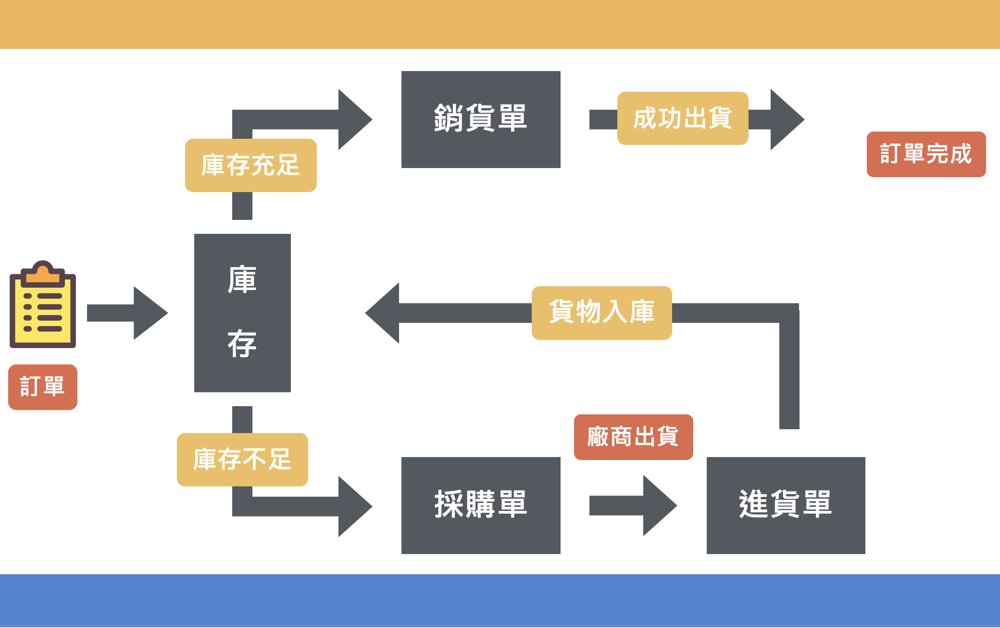

# TradeHub 
- 網站連結：https://www.tradehub17th.com/

### 技術使用

- 前端：TailwindCSS, daisyUI, Alpine.js, htmx
- 後端：Python, Django
- 資料庫：PostgreSQL
- 版本控制：Git
- 部署：AWS EC2/RDS

### TradeHub Team & 分工

陳俊道
https://github.com/toshi0809
- 客戶系統建置
- 訂購單系統建置
- 資料匯入/匯出功能
- 圖表儀表板功能
- 使用者權限功能

康珮萱
https://github.com/KangPeiHsuan
- 會員系統建置
- 表單內容驗證功能
- 小鈴鐺通知功能
- AWS/EC2部署建置

賴奕浤
https://github.com/Roger-0227
- 庫存系統建置
- 銷貨單系統建置
- 第三方登入功能
- 有限狀態機功能
- 全站搜尋功能

陳政杰
https://github.com/jaychen1007
- 產品系統建置
- 進貨單系統建置
- 公司資料建置

劉哲明
https://github.com/Liu-Che-Ming
- 供應商系統建置
- 採購單系統建置
- 訂單類型子表單功能
- 

### 安裝步驟

1. `poetry shell` 建虛擬環境
2. `poetry install` 下載 相應套件
3. `npm install` 下載 前端 相應套件
4. 使用`.env.example` 建立`.env`檔

### 執行檔案

1. `npm run dev` 執行 esbuild 和 tailwind
2. Win: `python manage.py runserver` Mac: `make server` 開啟伺服器
